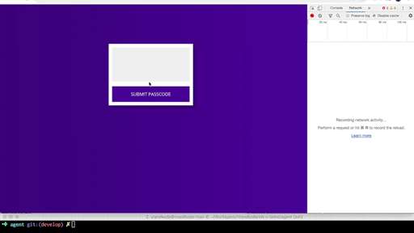

<p align="center">
  
</p>

<h1 align="center">stk</h1>

<p align="center">Secure lightweight broker for browser-based remote shell access.</p>

<p align="center">
  <code>Status: Active</code> · <code>Go · TypeScript</code> · <code>Noise Protocol</code> · part of <a href="https://trustsentinel.eu">TrustSentinel</a>
</p>

## Overview

stk puts a shell in the browser without exposing SSH to the network. A Go
agent/hub brokers end-to-end encrypted sessions over the **Noise Protocol**, with
an **xterm.js** terminal front end and TOTP/U2F authentication.

<p align="center">
  
</p>

## Architecture

```
┌──────────┐   Noise    ┌────────────┐   Noise    ┌──────────────┐
│ Browser  │ ─────────> │  stk hub   │ <───────── │  agent (host)│
│ xterm.js │   (WS)     │  (broker)  │   (WS)     │  shell + keys│
└──────────┘            └────────────┘            └──────────────┘
        end-to-end encrypted session, brokered — no open SSH port
```

## Layout
- `agent/` — host-side agent (Noise transport, shell, key handling)
- `auth/` — hub/broker + auth (peers, channels, protobuf); `auth/web/` is the TS/React terminal UI
- `common/` — shared protocol/helpers
- `reference/marshmallows-agent/` — sibling Noise agent kept for reference

## Status & roadmap
Working prototype (2019), being modernized under TrustSentinel:
- add `go.mod` and make it build/test in module mode
- proto2 → proto3 (connect-go/gRPC), WebAuthn, tests + CI, Docker image
- fold the marshmallows Noise agent (beacon/reconnect) into `agent/`

## License
MIT

<sub>Originally prototyped at bluebycode/stk (2019); continued under TrustSentinel.</sub>
