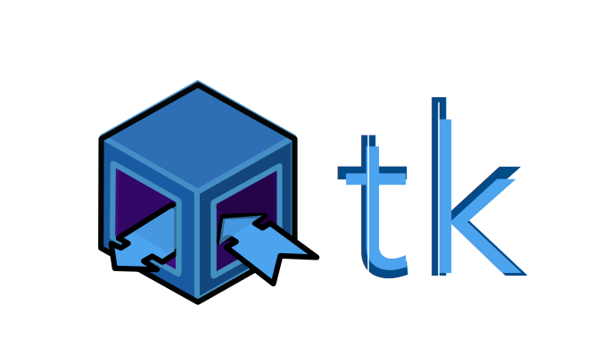
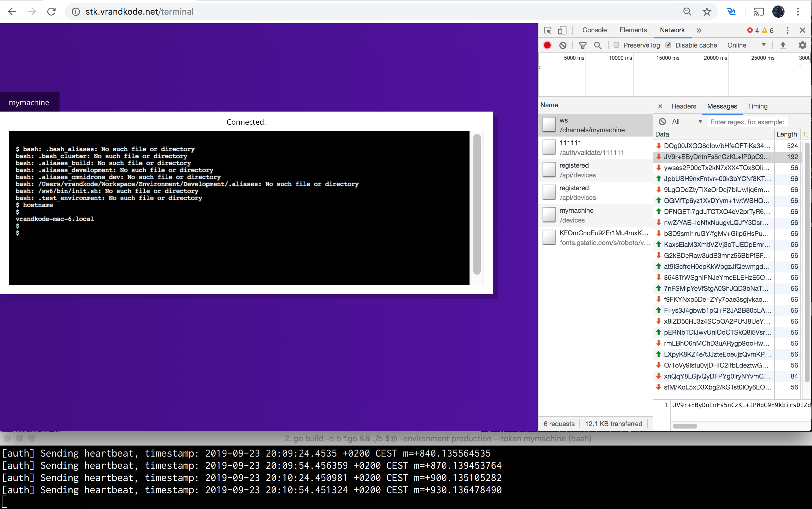

<p align="center">
  
</p>


`stk` is a secure lightweight broker for remote shell access.

> **Provenance.** This repository is the TrustSentinel continuation of the original
> prototype at [`bluebycode/stk`](https://github.com/bluebycode/stk) (2019, by
> [@bluebycode](https://github.com/bluebycode) / vrandkode). It was imported clean-start
> (no upstream history) and sanitized. See [ORIGIN.md](ORIGIN.md) for details. Not to be
> confused with [`trustsentinel/stuk`](https://github.com/trustsentinel/stuk), the
> port-knocking SSH access manager — a separate project.


Designed for any browser.

<p align="center">
  
</p>

**Agent**: ```./agent -environment production --token mymachine```

### Please install last 

**Usage**
---

```
go get 
```

**Installation Options**
---

1. Install with [`golang`]
    + `$ go get .`

2. Deploy from docker repository.


**Acknowledgements**
---

### Colaborators

* Álvaro López (@vrandkode)
* Guillermo Mora (@guillermijas)
